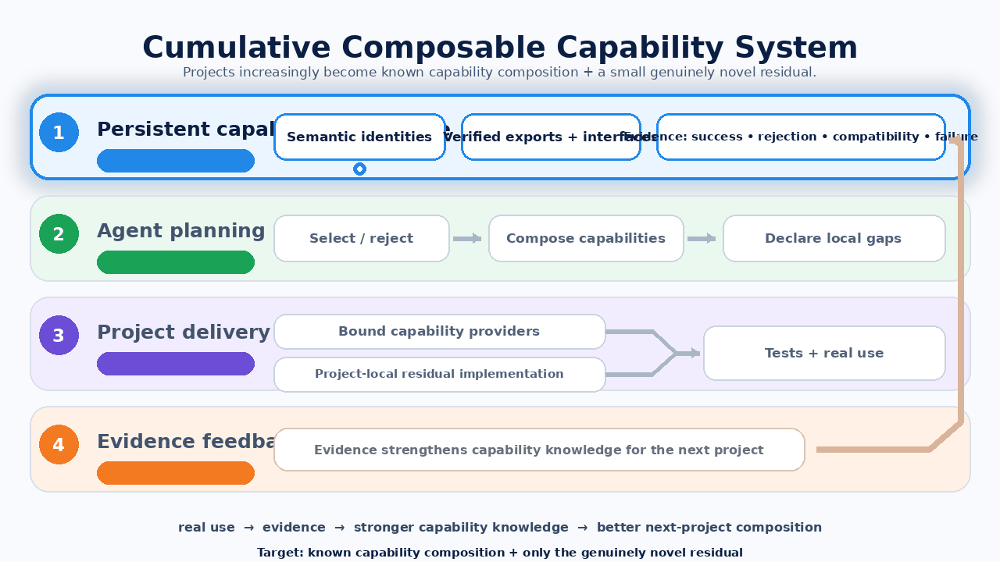
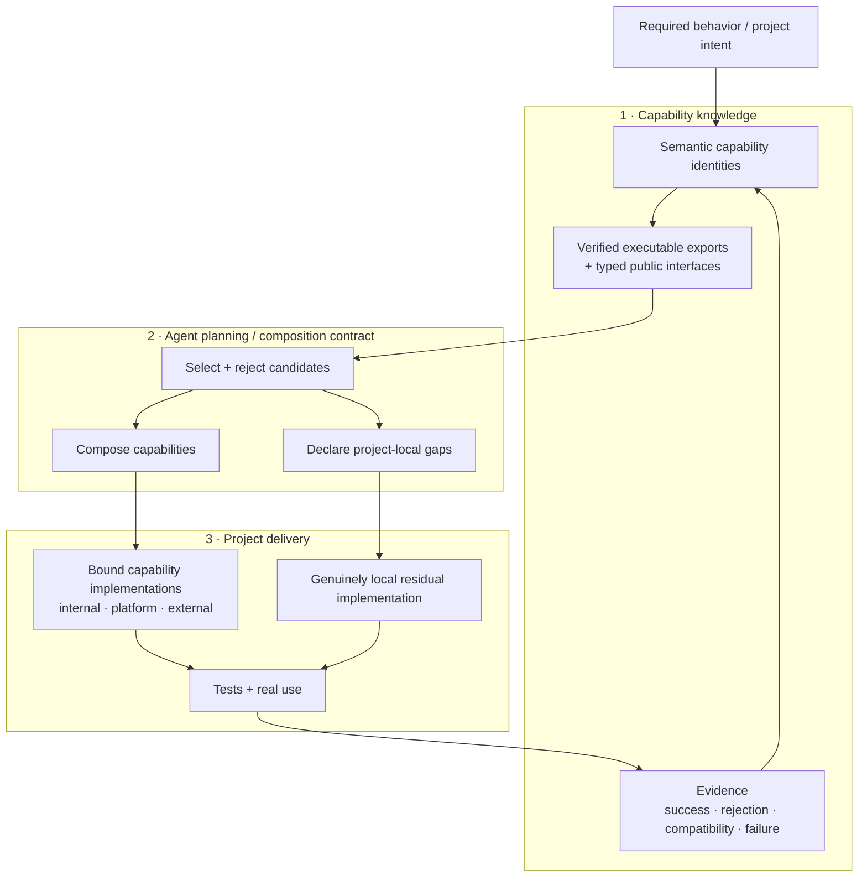

# Agentic Capability Architecture

> **Composable software functionality that compounds across projects.**
>
> Give coding agents persistent, machine-readable capability knowledge so they can **bind and compose verified functionality before writing new code**, keep genuinely domain-specific behavior local, and leave evidence that helps the next project start further ahead.

**[Why this matters to your agent →](TEAM_GUIDE.md)** · **[Try the working system →](QUICKSTART.md)** · **[Architecture charter →](docs/ARCHITECTURE_CHARTER.md)**

The main idea is **not** “use off-the-shelf software when possible.” That is only a sourcing rule. The architectural thesis is to make useful functionality **legible, bindable, composable, and cumulative for agents** so that a later project can increasingly be expressed as **known composition + a small genuinely novel residual**.

## At a glance

| | Current state | What it means |
|---|---|---|
| ✅ **Working** | capability catalog, typed exports, reusable code, engagement generator, pre-code capability plans, protected CI | there is real software to inspect and run |
| 🧪 **Being tested** | capability discovery, composition quality, evidence feedback, reuse maturity | the architecture is functional, but several claims still need stronger empirical proof |
| ❓ **Not yet proven** | capability-layer advantage vs. a control, commercial compounding, universal composition model | these remain explicit hypotheses, not marketing claims |

## Why point a coding agent here?

| Typical project-local agent | Capability-aware agent using this repository |
|---|---|
| Starts from requirements + whatever code is already nearby | Starts from requirements **plus accumulated capability knowledge** |
| Rediscovers familiar interfaces and patterns | Inspects **semantic capability identities and verified executable boundaries** |
| Reuse is implicit and opportunistic | **Selection, rejection, composition, and local gaps are explicit before coding** |
| Knowledge usually dies with the project | Successes, rejected fits, compatibility limits, and failures can feed the next project |
| “Reusable” often means “put it in a shared package” | Reuse is only one outcome; keeping behavior local can be the correct architectural result |

For paid/client work, `tools/engagement.py` turns that distinction into an actual workflow through `CAPABILITY_PLAN.yml`, isolated project-local implementation, and evidence/metrics closeout.

## The system in motion

<p align="center">
  
</p>

<p align="center"><sub><a href="docs/assets/capability-flywheel.png">Static version</a> · The animation highlights the four semantic stages; it is an explanatory projection, not an executable specification.</sub></p>

The model has distinct layers. **Capability knowledge persists across projects; planning decides what to bind and compose; project delivery keeps genuinely local behavior local; evidence from real use feeds the next decision.**

**Target shape:** later projects should become increasingly **composition-dominated**, with bespoke implementation shrinking toward genuinely novel domain behavior.

Each project is both a **consumer and a contributor**. That is the **cumulative, composable capability ecosystem** this repository is testing.

<details>
<summary><strong>Inspect the same architecture as an explicit diagram</strong></summary>



**Feedback path:** real use → evidence → stronger capability knowledge → better composition decisions on the next project.

</details>

## What may be novel here — and what is not

The ingredients are not individually novel. Reusing libraries, typed APIs, service catalogs, package ecosystems, CI, build-vs-buy decisions, and preferring mature software over reinvention are established software practices.

The differentiated hypothesis is the **integrated agent-facing loop**:

- provider-independent semantic capability identities;
- machine-readable capability knowledge with explicit executable exports;
- typed boundaries that agents can bind and compose;
- a required pre-code plan separating selected capabilities, rejected candidates, compositions, and local gaps;
- project-local behavior treated as a valid architectural outcome rather than failed abstraction;
- every project feeding success, failure, compatibility, and rejected-fit evidence back into the capability system;
- evidence-backed promotion instead of assuming generic-looking code is reusable;
- success measured by later projects becoming increasingly **composition-dominated**, not by the size of an internal library.

We do **not** claim this is historically unique or a world-first architecture without a dedicated landscape review. The potentially novel contribution is the **combination, the agent operating contract, and the attempt to make the capability/evidence flywheel measurable and falsifiable**.

## Machine-readable truth hierarchy

Agents should not treat every label in the repository as equally strong evidence.

| Strength | Source | Interpretation |
|---:|---|---|
| **1** | `semantic_exports` / `capability_catalog.py` | verified executable action boundary; strongest current callable claim |
| **2** | `public_interfaces` | declared public boundary; inspect source/tests for semantics not covered by an export |
| **3** | `provides` + capability metadata | discovery/scope information; **not by itself a callable guarantee** |
| **4** | evidence / maturity fields | useful only to the extent they are current and backed by real use/test evidence |
| **5** | prose / historical proof material | context and rationale; never stronger than current code/machine truth |

If code and metadata disagree, surface the disagreement as a defect. Do not silently infer a capability that the executable boundary does not support.

### Inspect the verified executable surface

```bash
python tools/capability_catalog.py list --json
python tools/capability_catalog.py describe state.transition.plan --json
python tools/capability_catalog.py check
```

The audited exports currently include `approval.resolve`, `availability.query`, `state.transition.plan`, and `notification.email.send`. Broader capability scope may exist in manifests, but agents should not treat it as an executable action until it has an honest bound export/interface.

## What exists today

- capability registry + capability manifests;
- manifest-derived semantic action catalog with audited implementation boundaries;
- reusable capability implementations and multiple proof applications;
- explicit composition plus project-local extension boundaries;
- engagement generator producing a portable worker capability snapshot;
- `CAPABILITY_PLAN.yml` for pre-code selection, rejection, local-alternative/net-value comparison, composition, interfaces, and local-gap reasoning;
- validation for schema/requirement coverage, known internal exports/interfaces, and cooperative-workflow snapshot consistency;
- evidence, provenance, compatibility, rejection, maturity, and promotion records;
- tests and protected CI covering repository contracts and proof applications.

> **Current trust boundary:** the engagement workflow is a **planning and evidence discipline for a cooperative worker**, not an adversarial sandbox or automatic IP-redaction system. The shipped checksum/self-check detects ordinary changes relative to the shipped snapshot, but because the worker receives the hash file and validator it is not a tamper-proof trust boundary. Evidence sanitization still requires human review. See [`docs/ENGAGEMENT_OPERATING_SYSTEM.md`](docs/ENGAGEMENT_OPERATING_SYSTEM.md).

## Supporting sourcing policy

**Off-the-shelf wins ties.** Provider sourcing matters, but it is not the main invention. A capability may be implemented by native platform behavior, an installed package, external OSS/SaaS, a standard, or internal code. The architecture cares that the behavior is represented honestly, exposed through a usable boundary, composable with other behavior, and backed by evidence.

Before creating shared implementation, investigate native/runtime features, installed ecosystem options, mature external implementations, existing standards/protocols, and internal capabilities. Implement a local gap when none of those honestly satisfies the requirement.

## What is not proven yet

This is a working technical system and research architecture, not proof that the capability flywheel pays for its overhead.

A [preliminary market-derived control/treatment experiment](docs/experiments/UPWORK_ATS_CAPABILITY_EXPERIMENT.md) now has one Codex pair and one Claude Code pair. All arms passed the same hidden behavior tests. Codex treatments were faster and wrote less/shallower bespoke code but consumed more input context; both Claude arms hit the same fixed time ceiling, while the Claude treatment still left a materially smaller/shallower implementation and completed more of the closeout loop. The experiment also produced one concrete flywheel iteration: real task pressure exposed a missing verified availability boundary; after publishing the already-existing implementation, new fresh agents selected and composed it without any task hint. A second Upwork-derived order-approval experiment is a useful counterexample: the capability-aware agent composed Approvals + Core correctly and reduced control-flow branching, but it was slower and much more context-expensive than control. This remains a tiny sample and needs replication before claiming a general advantage; the key question is now **when composition pays for its discovery/integration cost**, not merely whether composition is possible.

The commercial hypothesis is also unproven: there is not yet a comparable 5–10 paid-engagement cohort showing that composition increases while marginal delivery effort and cost fall.

## Try it

Start with [`QUICKSTART.md`](QUICKSTART.md). The included Shipment Exception flow is a **guided mechanics demonstration**, useful for understanding the workflow but intentionally not treated as clean proof of independent capability discovery.

For the team-facing explanation of what to ask your coding agent to do, see [`TEAM_GUIDE.md`](TEAM_GUIDE.md).

<details>
<summary><strong>Deeper technical context</strong></summary>

Repository-local documentation is indexed in [`docs/README.md`](docs/README.md). The current charter is [`docs/ARCHITECTURE_CHARTER.md`](docs/ARCHITECTURE_CHARTER.md), the one-diagram view is [`docs/ARCHITECTURE_ONE_DIAGRAM.md`](docs/ARCHITECTURE_ONE_DIAGRAM.md), and current proof status is indexed in [`docs/PROOF_LEDGER_EXTENDED.md`](docs/PROOF_LEDGER_EXTENDED.md).

For cross-repository context, use the [Vision knowledge index](https://github.com/BrianMills2718/vision/blob/main/wiki/index.md) and [Agentic Capability Architecture project guide](https://github.com/BrianMills2718/vision/blob/main/wiki/projects/agentic-capability-architecture.md).

### Local role and boundaries

This is the **sole active capability-architecture lineage**. It owns capability/provider metadata, honest reusable public implementation boundaries, conservative capability resolution, reuse/maturity evidence, engagement planning contracts, and the local proof fixtures used to test those ideas.

It does **not** own upstream application meaning, a universal workflow engine, a scheduler, authorization platform, notification platform, package registry, observability system, or a universal primitive runtime. The primitive vocabulary/composition work under `architecture/primitive_model/` remains experimental.

Shared capabilities must not absorb consequential client/project semantics merely to increase reuse. The intended mature project shape is:

```text
known capability composition
        +
small genuinely novel project-local residual
```

### Proof applications

Client Intake + Booking, Internal Procurement, IT Access Control, Facility Maintenance, Service Desk, Shared Resource Reservation, and the acceptance sandboxes are primarily **architecture proof fixtures**. They demonstrate reuse pressure, local semantics, compatibility, portability, and agent behavior. They are not a mandate to rebuild mature business platforms.

</details>

## Status

This remains experimental architecture research with real working code and bounded proof results. The validated claims are implementation/proof claims, not proof of a universal composition language, a universal application runtime, or commercial compounding. Current completed and pending proof claims are indexed in [`docs/PROOF_LEDGER_EXTENDED.md`](docs/PROOF_LEDGER_EXTENDED.md).
