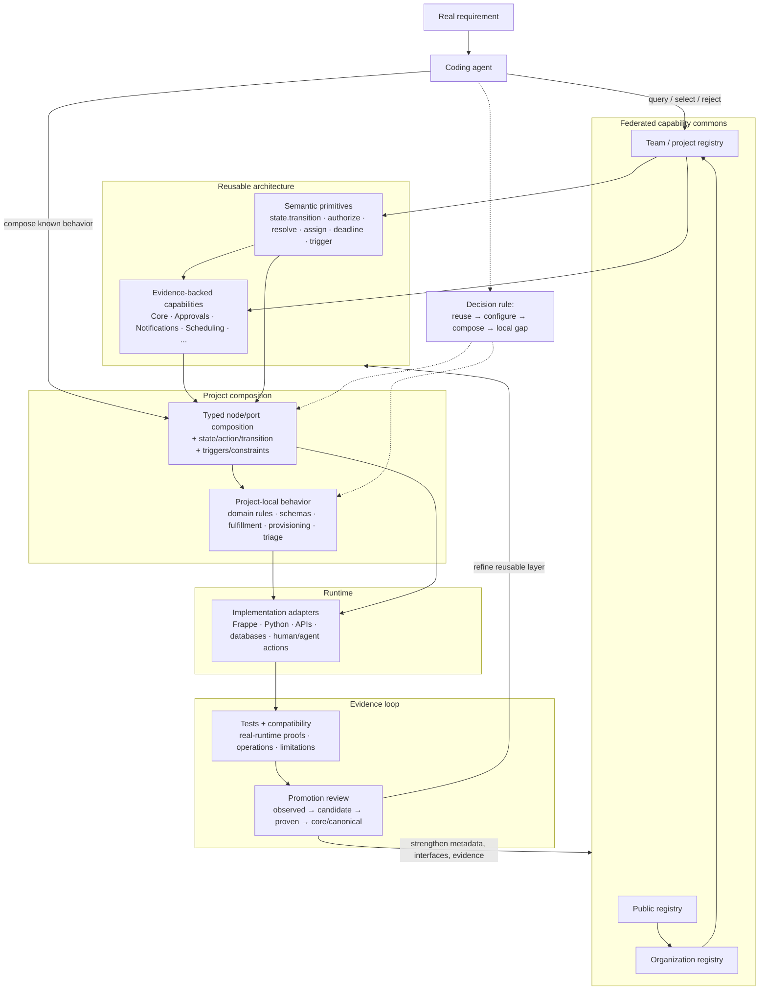

# Agentic Capability Architecture — One Diagram



## How to read it

- **Primitives** are small semantic operations with stable execution meaning.
- **Capabilities** are evidence-backed reusable packages with interfaces, configuration, dependencies, tests, and maturity.
- **Project composition** combines reusable pieces through typed connections and explicit lifecycle/trigger semantics.
- **Project-local behavior** preserves domain meaning when generalization would erase important distinctions or increase coupling.
- **Runtime adapters** execute the plan in concrete systems; Frappe is the current substrate, not the abstract architecture.
- **Evidence** flows back from tests, real deployments, compatibility checks, failures, and independent-agent use.
- **Promotion** is evidence-based rather than automatic.
- **Federation** lets public, organizational, and project registries accumulate reusable capability without forcing one monolithic codebase.

The intended flywheel is:

```text
real project
→ discover existing capability
→ compose what fits
→ implement only local gaps
→ test under new pressure
→ contribute compatibility evidence
→ strengthen the shared commons
→ make the next project easier
```

The architecture is successful when agent work shifts from repeated reinvention toward reliable **discovery, selection, composition, and evidence-producing local implementation**.
