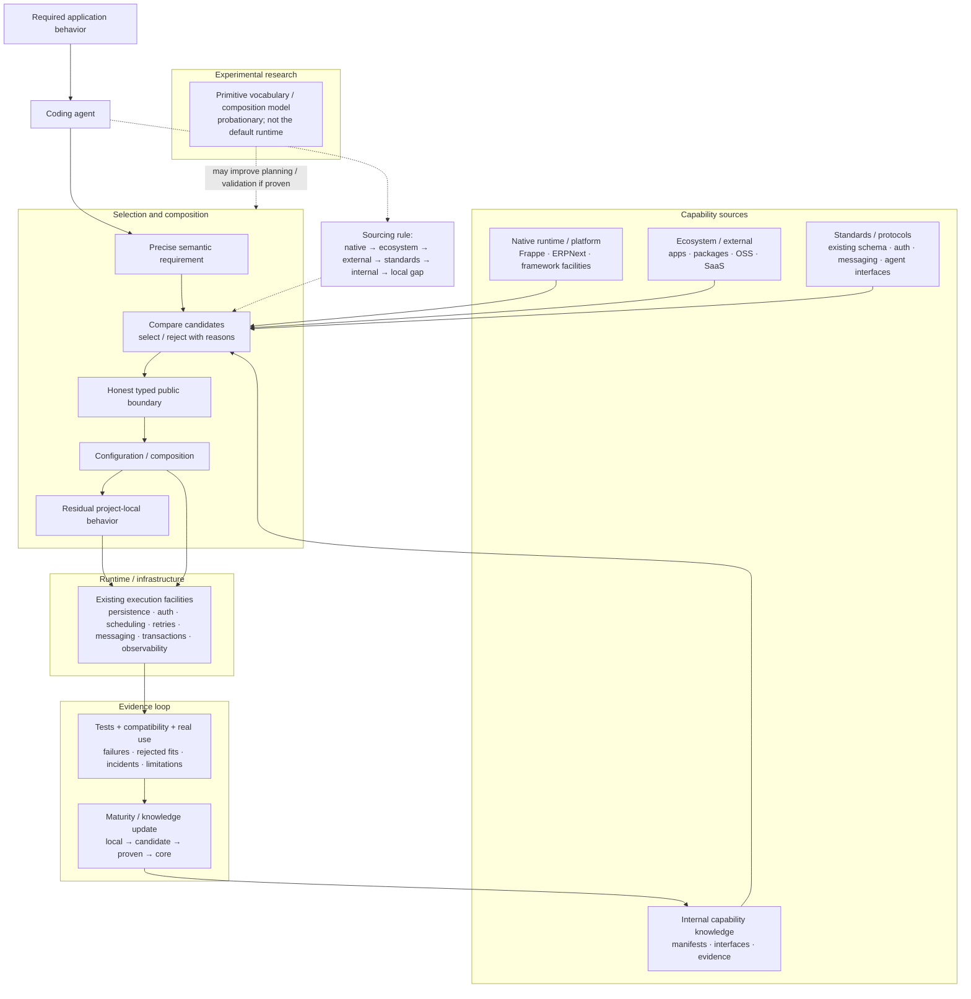

# Agentic Capability Architecture — One Diagram

This diagram is an explanatory view of the current charter, not an independent architecture authority.



## How to read it

- **Start from required behavior, not from an internal package name.**
- **Capability sources are plural.** Native framework features, established packages/services, standards, and internal capabilities are all legitimate providers.
- **Selection is the strategic layer.** The agent should choose or reject candidates based on semantic fit, interfaces, constraints, evidence, and operational considerations.
- **Typed public boundaries** should reuse existing honest APIs/functions where possible; adapters exist for real translations, not symmetry.
- **Project-local behavior** remains first-class when abstraction would erase consequential domain meaning.
- **Runtime infrastructure** should usually be off-the-shelf/platform-native rather than rebuilt inside this repository.
- **Evidence** includes successful reuse and also failed fits, rejected providers, compatibility limits, incidents, and independent-consumer results.
- **Primitive research** is intentionally shown off the critical path. A semantic primitive may become useful planning/validation vocabulary without becoming a runtime owned here.

The intended flywheel is:

```text
real requirement
→ search all credible sources
→ select the best existing fit
→ implement only the residual local gap
→ test under real pressure
→ record success, rejection, and failure evidence
→ improve the next sourcing decision
```

The architecture is successful when agent work shifts from repeated reinvention toward reliable **discovery, selection, composition, and evidence-producing local implementation**, regardless of who owns the selected implementation.
